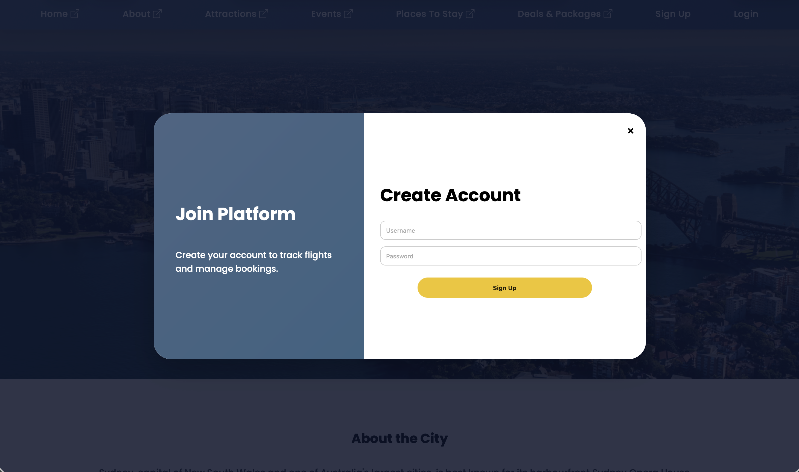

##  Tech Stack


---

#  Sydney Travel Platform

A modern **full-stack travel web application** combining **tourism exploration**, **flight search**, and **user authentication/dashboard** — designed with a clean, production-style UI.

---

##  Overview

This project simulates a **real-world travel platform** where users can:

* Explore Sydney tourism content
* Search for flights (Return / One-way)
* Manage sessions via authentication
* View personalized dashboard data

Built with a focus on:

*  Clean UI/UX
*  Fast interactions
*  Modular structure

---

##  Features

✔ Sydney tourism showcase (Attractions, Events, Stay, Deals)
✔ Flight search (Return & One-way toggle)
✔ Swap locations functionality
✔ Traveller selection dropdown
✔ User authentication (Login + Signup Modal)
✔ Dashboard with flight history
✔ Real flight redirection (Google Flights)
✔ Form validation & UX enhancements

---

##  Architecture

* **Frontend:** EJS + CSS + Vanilla JavaScript
* **Backend:** Node.js + Express
* **Rendering:** Server-side with EJS
* **Routing:** Express-based route handling

---

##  Screenshots

###  Homepage


---

###  About Section


---

###  Attractions


---

###  Flight Search (Return)


---

###  Flight Search (One-way)


---

###  Form Validation


---

###  Login Page


---

###  Signup Modal (New UI)



---

###  Dashboard


---

###  Flight Results


---

##  Installation

Clone the repository:

```bash
git clone https://github.com/TejinderS1130/sydney-travel-platform.git
cd sydney-travel-platform
```

Install dependencies:

```bash
npm install
```

Run the server:

```bash
node server.js
```

Open in browser:

```
http://localhost:3000
```

---

##  Key Highlights

*  Real-world UI inspired by modern travel platforms
*  Authentication flow with modal-based signup
*  Clean separation of frontend and backend
*  Smooth user interactions and dynamic rendering
*  Portfolio-ready full-stack project

---

##  Future Improvements

*  Flight API integration (Amadeus / Skyscanner)
*  Database integration (MongoDB)
*  Deployment (Render / Vercel)
*  Full mobile responsiveness
*  Secure authentication (JWT / sessions)

---

## Author

**Tejinder Singh**
Aspiring SOC Analyst | Cybersecurity Enthusiast

---
