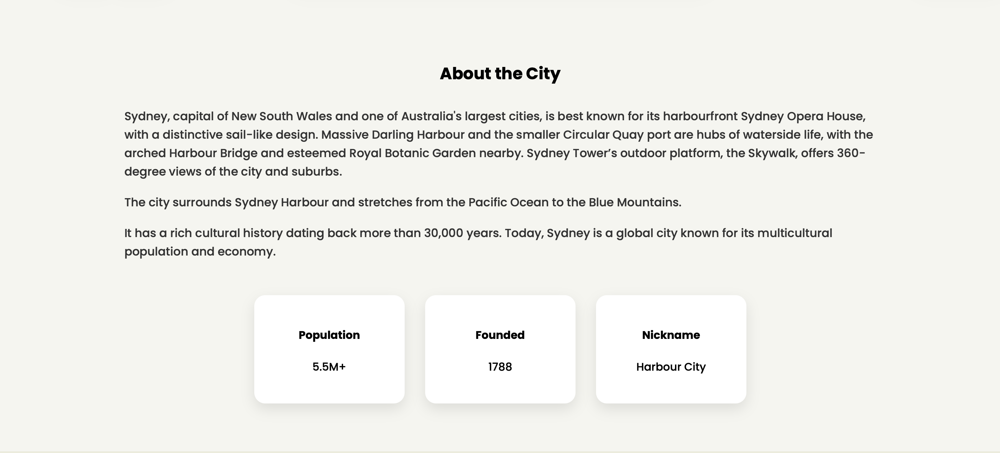
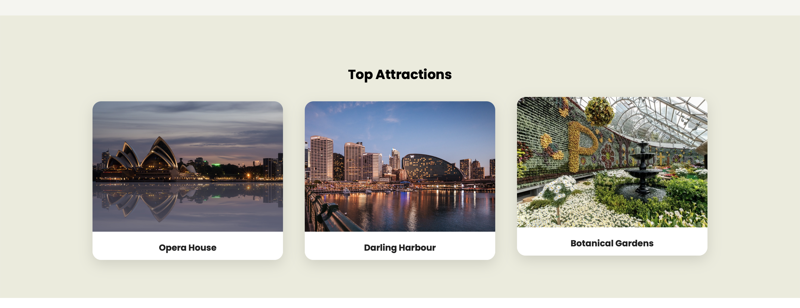
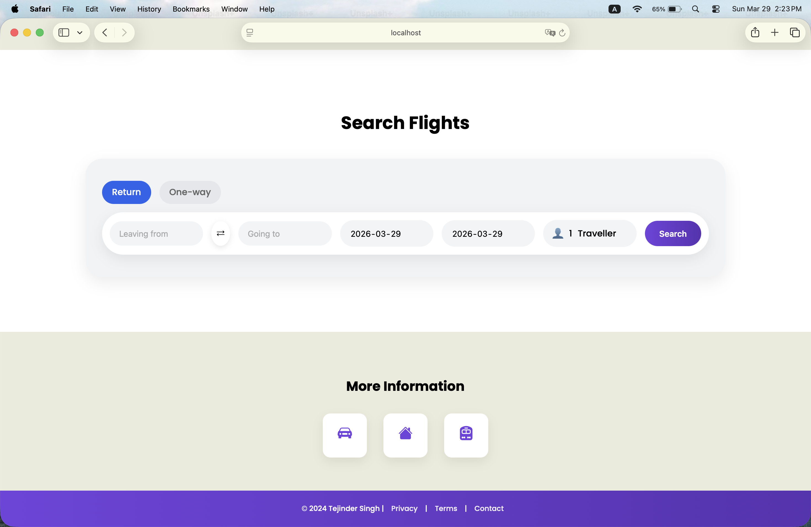
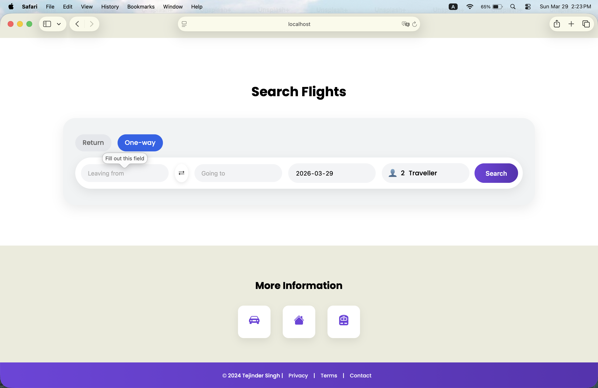
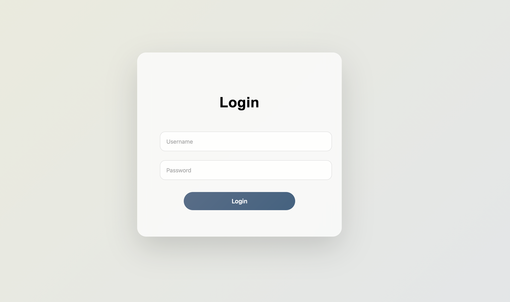
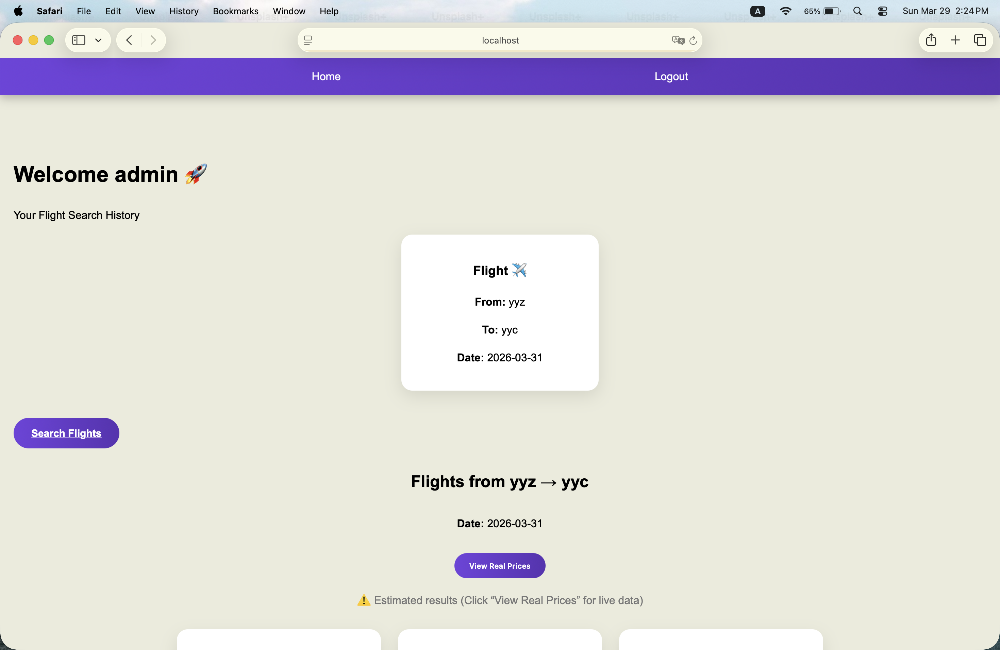
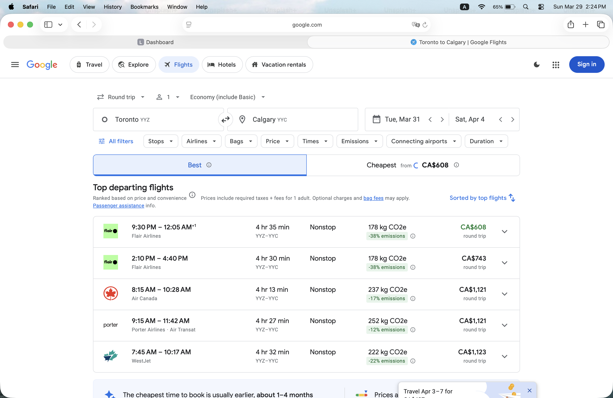

## 🛠️ Tech Stack


---

#  Sydney Travel Platform 

A full-stack travel web application that combines **tourism exploration** with a **flight search system** and **user dashboard**.

---

##  Features

*  Sydney tourism showcase (Attractions, Events, Stay, Deals)
*  Flight search (Return & One-way)
*  Swap locations functionality
*  Traveller selection
*  User authentication (Login system)
*  Dashboard with flight history
*  Real flight redirection (Google Flights integration)

---

##  Project Architecture

* **Frontend**: EJS + CSS + JavaScript
* **Backend**: Node.js + Express
* **Views**: Dynamic rendering using EJS
* **Routing**: Express routes for login, dashboard, search

---

##  Screenshots

###  Homepage


###  About Section



###  Attractions



###  Flight Search (Return)



###  Flight Search (One-way)


###  Form Validation



###  Login Page



###  Dashboard



###  Flight Results



---

##  Installation

Clone the repository:

```bash
git clone https://github.com/TejinderS1130/sydney-travel-platform.git
cd sydney-travel-platform
```

Install dependencies:

```bash
npm install
```

Run the app:

```bash
node server.js
```

Open in browser:

```
http://localhost:3000
```

---

##  Key Highlights

* Real-world UI/UX design similar to modern travel platforms
* End-to-end full-stack implementation
* Clean component-based structure
* Interactive user experience

---

##  Future Improvements

*  Real flight API integration (Skyscanner / Amadeus)
*  Database (MongoDB) for user data
*  Deployment (Render / Vercel)
*  Mobile responsiveness enhancements

---

## Author

**Tejinder Singh**
Aspiring SOC Analyst | Cybersecurity Enthusiast

---


